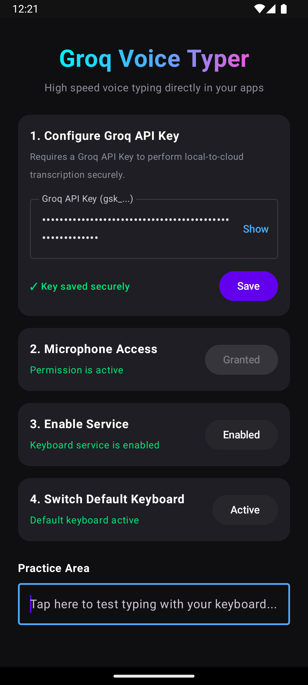
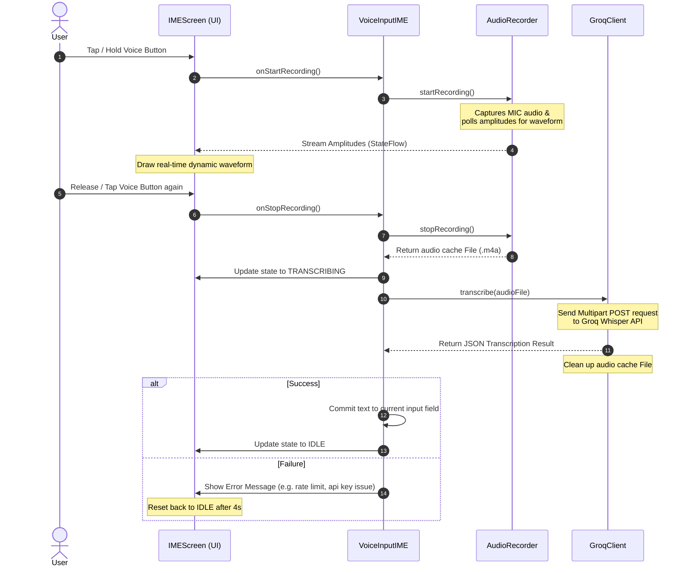

# AI Voice Typer for Android 🎙️🚀

[](https://github.com/raviumeshkulkarni-web/AI-Voice-typer/actions/workflows/build.yml)
[](https://github.com/raviumeshkulkarni-web/AI-Voice-typer/releases)
[](https://opensource.org/licenses/Apache-2.0)
[](https://developer.android.com)
[](https://kotlinlang.org)

AI Voice Typer is a lightweight, modern, and privacy-focused Android Voice Keyboard (IME) powered by the ultra-fast **Groq Whisper API**. It lets you dictate directly into any application's text fields at blistering speeds.

<p align="center">
  
  &nbsp;&nbsp;&nbsp;&nbsp;&nbsp;&nbsp;&nbsp;&nbsp;
  
</p>

---

## 🏆 Why AI Voice Typer? (vs. the Competition)

Most voice typing tools compromise between accuracy, privacy, and speed. **AI Voice Typer doesn't.**

It's powered by **OpenAI Whisper Large v3** running on Groq's ultra-fast inference hardware — delivering accuracy that beats every built-in dictation tool available today, without any background telemetry or data collection.

| Metric / Feature | **AI Voice Typer** (Whisper v3 on Groq) | Google Speech-to-Text | Windows Dictation (Win + H) |
|---|---|---|---|
| **Average Accuracy** | 92% – 97.9% | 79% – 88% | 85% – 92% |
| **Word Error Rate (WER)** | ~2.7% *(clean audio)* | ~11.6% – 16.5% | ~10% – 15% |
| **Processing Style** | Contextual Batch *(phrases)* | Streaming *(word-by-word)* | Streaming *(word-by-word)* |
| **Background Noise Handling** | ✅ Excellent *(trained on raw audio)* | 🟡 Good *(cloud filtering)* | 🔴 Average *(struggles with cross-talk)* |
| **Privacy** | ✅ Open source, no telemetry | ❌ Data sent to Google | ❌ Data sent to Microsoft |
| **Works in Any App** | ✅ System-wide keyboard | ❌ Browser/limited apps only | ❌ Windows apps only |

> **Bottom line:** You get near-human transcription accuracy system-wide, in any text field, on any Android app — with full privacy.

---

## 🔒 The Privacy-First Approach

**Built for users who love and demand absolute privacy.** 

Unlike conventional voice typing tools and keyboards, **Groq Voice Typer does not collect, store, or transmit any user data, telemetry, or typing behavior.** We believe in building instant user trust through complete transparency:

* **100% Open Source:** The entire codebase is open and inspectable. What you see here is exactly what gets compiled and runs on your device.
* **No Telemetry or Tracking:** Zero analytics scripts, tracking code, or background usage logging.
* **Direct HTTPS Communication:** Your recorded audio goes directly from your device to the official Groq API servers via HTTPS (TLS 1.3). No intermediate custom servers or proxies are involved.
* **Local Encryption at Rest:** Your Groq API Key is encrypted using Android Keystore-backed cryptography (`EncryptedSharedPreferences`).
* **Zero Audio File Footprint:** Audio files are stored temporarily in private internal cache space and are explicitly deleted the millisecond a transcription finishes or fails.

---

## Key Features

* **High-Speed Transcription:** Direct integration with Groq's `whisper-large-v3` API for near-instant, high-accuracy English speech-to-text.
* **Privacy & Security First:**
  * **Encryption at Rest:** Your Groq API Key is encrypted locally using Android's hardware-backed Keystore system (`EncryptedSharedPreferences`).
  * **No Telemetry:** Zero third-party analytics, tracking, or telemetry libraries.
  * **Direct Calls:** App communicates strictly with the official Groq API endpoint (`https://api.groq.com`).
  * **Ephemeral Storage:** Audio files are stored temporarily in the internal cache directory and explicitly deleted immediately after transcription finishes.
* **Premium User Interface:**
  * Beautiful dark-mode interface built using **Jetpack Compose**.
  * Dynamic, canvas-drawn live audio waveform visualization.
  * Easy-to-use setup wizard to configure permissions and keyboard settings.
* **Smart Input Interactions:**
  * Supports both **Tap-to-speak** (toggles start/stop) and **Hold-to-speak** (release to transcribe) gestures.
  * Includes quick Spacebar, Enter, Backspace, and IME Switch keys.

---

## Technical Architecture

The following sequence diagram outlines the end-to-end data flow when voice typing:



---

## How to Install & Build

### Option A: Download the Pre-compiled APK (Recommended)

1. Navigate to the [Releases](https://github.com/raviumeshkulkarni-web/AI-Voice-typer/releases) page of this repository.
2. Download the `app-release.apk` asset from the latest release.
3. Open the APK on your Android device and install it (you may need to allow installation from "Unknown Sources" or your web browser).

### Option B: Build Locally via Android Studio

1. Clone this repository:
   ```bash
   git clone https://github.com/raviumeshkulkarni-web/AI-Voice-typer.git
   ```
2. Open the project in **Android Studio** (Koala or newer recommended).
3. Connect your Android device (with USB debugging enabled) or start an Emulator.
4. Click the **Run** button to build and install the application.

---

## Setup & Configuration Guide

After installing the app, follow these simple steps inside the configuration wizard:

1. **Paste your Groq API Key** (starts with `gsk_`) and click **Save**. (You can get an API key for free from the [Groq Console](https://console.groq.com)).
2. **Grant Microphone Permission** so the keyboard can record audio.
3. **Enable Keyboard Service** in Android System Settings.
4. **Switch Default Keyboard** to make **Groq Voice Typer** your active input method.
5. Practice and test typing directly within the app's **Practice Area** text field!

---

## 🛠️ Troubleshooting

### 1. The keyboard shows "API Key Required" even though I entered it
* Make sure you clicked the **Save** button in the main setup screen. The API key is stored securely using cryptography only after you click Save.
* Try reopening the Setup app to confirm that the screen displays `✓ Key saved securely`.

### 2. The keyboard voice button does not react to taps or holds
* Verify that you have enabled microphone permissions for Groq Voice Typer in the Setup app or under Android system settings: `Settings > Apps > Groq Voice Typer > Permissions > Microphone > Allow`.

### 3. Transcription fails with a red error message
* **Rate Limits**: Groq's free tier has rate limits. If you record very frequently, you might temporarily hit rate limits.
* **Internet Connection**: The app requires an active internet connection to communicate directly and securely with the Groq API.
* **Invalid API Key**: Ensure there are no trailing spaces or missing characters in your pasted API key.

---

## Tech Stack

* **Language:** Kotlin
* **UI Toolkit:** Jetpack Compose (Material 3)
* **Network:** OkHttp
* **Security:** AndroidX Security Crypto (EncryptedSharedPreferences)
* **API Engine:** Groq Whisper Speech-to-Text (`whisper-large-v3`)

---

## License

This project is open-source and available under the [Apache License 2.0](LICENSE).
