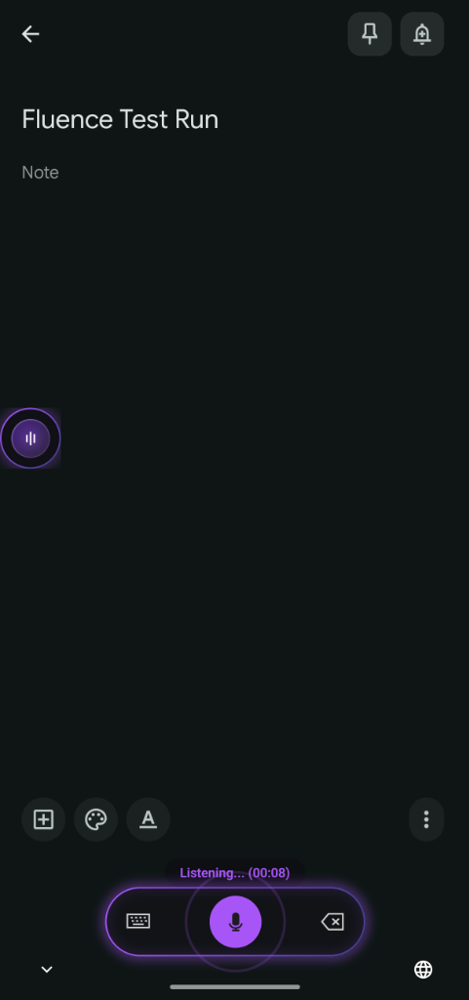
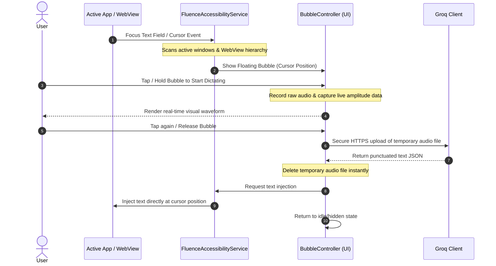

# Fluence 🎙️✨

### *Crystallize your cognition at the speed of thought*

[](https://github.com/raviumeshkulkarni-web/Fluence/actions/workflows/build.yml)
[](https://github.com/raviumeshkulkarni-web/Fluence/releases)
[](https://opensource.org/licenses/Apache-2.0)
[](https://developer.android.com)
[](https://kotlinlang.org)

**An AI powered voice typing system wide on Android, right at your cursor.**

Fluence is a lightweight, premium, and privacy-focused Android voice typing system powered by the ultra-fast **Groq Whisper API (`whisper-large-v3`)** for cloud-based dictation, and a fully on-device **Alibaba SenseVoice-Small ONNX engine** for offline voice typing. Instead of forcing you to use a custom software keyboard, Fluence overlays a smart, floating bubble that automatically appears next to any text field when you focus it, whether you're browsing the web in **Brave/Chrome** or typing a message in a native messaging app.

---

## 🎬 Visual Showcase
| 1. Watch It In Action | 2. Focused Text Box (Listening State) | 3. Active Dictation & Recording | 4. Premium Setup Wizard |
| :---: | :---: | :---: | :---: |
| <video src="https://github.com/user-attachments/assets/19a09852-70a6-434b-9776-315376f025bb" width="220px" controls></video> <br> *Full app demo* |  <br> *Subtle floating bubble active* |  <br> *Real-time visual waveform feedback* |  <br> *Permissions status & configuration* |

---

## 🏆 The Problem & Solution

**The Dictation Bottleneck:**
Traditional dictation systems are either slow, unpunctuated, or restricted to a specific custom keyboard. Google's streaming STT dictates word-by-word and frequently gets homophones wrong because it lacks contextual sentence-level comprehension. Furthermore, closed-source keyboards pose a massive telemetry and data privacy risk.

**The Fluence Solution:**
Fluence waits for you to finish your sentence/phrase, transcribes it using **OpenAI's Whisper Large v3** model on Groq's LPU inference hardware in less than a second, and automatically injects fully-punctuated, context-aware text directly at your cursor.

| Feature | **Fluence** (Groq Whisper v3) | Google Speech-to-Text |
| :--- | :---: | :---: |
| **Accuracy** | **92% – 97.9%** (Human level) | 79% – 88% |
| **Punctuation** | **Automatic & Intelligent** | Rigid / Word-by-word |
| **Privacy** | **Open Source (Zero Telemetry)** | Closed Source (Data collected) |
| **System-wide Overlay** | **Yes (Floating WisprFlow Bubble)** | No (Restricted to keyboard) |
| **Accent & Jargon Handling** | **Excellent (680k hr dataset)** | Average (Often stumbles) |

---

## 🔒 Privacy & Local Security

Built for users who refuse to compromise on data security:
* **Zero Telemetry or Logs:** No tracking code, analytics scripts, or background logging.
* **Android Keystore Encryption:** Your Groq API Key is encrypted locally using hardware-backed cryptography via `EncryptedSharedPreferences`.
* **Direct HTTPS Transmission:** Audio is sent directly from your device to the official Groq API endpoint (`https://api.groq.com`). No middleman, no intermediate servers.
* **Ephemeral Storage:** The captured audio snippet is temporarily saved in your app's private cache and **deleted immediately** the millisecond the transcription succeeds or fails.

---

## 🛠️ Core Features

* **Offline Transcription Mode 🔌:** Toggle 100% offline, English-only voice typing. Downloads Alibaba's **SenseVoice-Small** quantized model (~230MB) directly to internal storage on-demand. Audio is processed completely locally via the `sherpa-onnx` runtime with zero telemetry or cloud connection. Includes intelligent VAD (Voice Activity Detection) and automatic checksum verification.
* **Floating Bubble for easy access:** A sleek, glassmorphic bubble overlay that follows your focus. Tap to speak, or hold to talk and release to instantly transcribe.
* **AI Agent Mode 🤖:** Double-tap the microphone button/orb in the keyboard or floating bubble to activate Agent Mode. Powered by **Llama 3.3 70B**, Agent Mode processes natural language voice commands to edit or generate text directly inside any app:
  * *"Delete the last two sentences"* (calculates and performs precise local character deletion).
  * *"Make it professional"* or *"Translate this to French"* (rewrites and replaces the text before your cursor).
  * *"Draft an email to Bob explaining why I'm late"* (generates and inserts new text at your cursor).
  * *"Select all"* or *"Send"* (executes cursor selections or automatically submits form text).
* **Multi-Window Focus Engine:** Custom Accessibility Service checks active native app windows and nested WebViews (like Brave and Chrome) to ensure the bubble appears next to any editable input.
* **Ultra-Low Latency:** Transcribes sentences in under `0.5s–1s` via Groq LPU API.
* **Intelligent Text Injection:** Fallback mechanics inject text at the current cursor position, falling back to appending if standard cursor focus is blocked.
* **Battery-Optimized:** Zero background drainage; the service remains completely idle until a text window focus event is captured.

---

## 📐 Architecture & Flow



---

## 🚀 Installation & Setup

### Option A: Download Pre-compiled APK (Recommended)
1. Head to the [Releases](https://github.com/raviumeshkulkarni-web/Fluence/releases) page.
2. Download `app-release.apk` from the latest release.
3. Open the downloaded file to install (grant permission to "Install from Unknown Sources" if prompted).

### Option B: Build from Source
1. Clone the repository:
   ```bash
   git clone https://github.com/raviumeshkulkarni-web/Fluence.git
   ```
2. Open the project in **Android Studio** (Koala or newer).
3. Connect your device (with USB debugging enabled) and click **Run**.

### Onboarding Steps
1. **Enter Groq API Key**: Paste your key (starts with `gsk_`) from the [Groq Console](https://console.groq.com).
2. **Microphone Permission**: Allow the app to record your voice.
3. **Accessibility Service**: Turn on **Fluence** in your system accessibility settings (this allows it to detect when text fields are focused).
4. **Draw Over Other Apps**: Grant overlay permission so the bubble can float near your cursor.
5. **Practice Field**: Try out the dictation right inside the configuration screen!

---

## ⚙️ Troubleshooting

#### 1. The bubble is not appearing in certain text fields
* Make sure you have enabled the **Fluence Accessibility Service** in settings.
* Try tapping outside the text field and tapping back in to trigger a fresh focus event.

#### 2. The app returns a red error when transcribing
* **Network Status**: Check your internet connection.
* **Invalid Key**: Verify that your Groq API key is correct and doesn't contain extra spaces.
* **Rate Limits**: If you record multiple short phrases in quick succession, you may temporarily hit Groq's API rate limits.

---

## 💻 Tech Stack
* **Language:** Kotlin
* **UI Toolkit:** Jetpack Compose (Material 3)
* **Network Client:** OkHttp
* **Local Security:** AndroidX Security Crypto
* **AI Engines:**
  * **Cloud:** Groq Whisper STT API (`whisper-large-v3`) & Llama 3.3 (`llama-3.3-70b-versatile`)
  * **Offline/On-Device:** Alibaba SenseVoice-Small (quantized int8 ONNX) via the `sherpa-onnx` runtime engine and Silero VAD for voice activity detection

---

## 📄 License
This project is open-source and licensed under the [Apache License 2.0](LICENSE).
