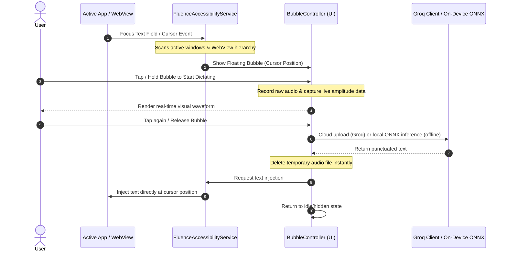

# Fluence 🎙️✨

### *Crystallize your cognition at the speed of thought*

[](https://github.com/raviumeshkulkarni-web/Fluence/actions/workflows/build.yml)
[](https://github.com/raviumeshkulkarni-web/Fluence/releases)
[](https://opensource.org/licenses/Apache-2.0)
[](https://developer.android.com)
[](https://kotlinlang.org)

**An AI powered, system-wide voice typing app for Android. Works online and fully offline.**

Fluence is a lightweight, privacy-focused Android voice typing app that works two ways: cloud mode uses the **Groq Whisper API (`whisper-large-v3`)** for fast, highly accurate transcription, and offline mode runs **Alibaba SenseVoice-Small** entirely on your device with no internet required. Either way, a glassmorphic floating bubble sits next to your cursor and injects text directly into whatever app you are typing in.

> ✦ **Agent Mode & Offline Mode are now both live in v1.3.0.**

---

## 🎬 Visual Showcase
| 1. Watch It In Action | 2. Focused Text Box (Listening State) | 3. Active Dictation & Recording | 4. Premium Setup Wizard |
| :---: | :---: | :---: | :---: |
| <video src="https://github.com/user-attachments/assets/19a09852-70a6-434b-9776-315376f025bb" width="220px" controls></video> <br> *Full app demo* |  <br> *Subtle floating bubble active* |  <br> *Real-time visual waveform feedback* |  <br> *Permissions status & configuration* |

---

## 🏆 The Problem & Solution

**The Dictation Bottleneck:**
Traditional dictation tools are slow, unpunctuated, or locked to a specific keyboard. Google's streaming STT transcribes word-by-word and frequently misses homophones because it lacks full sentence context. Closed-source keyboards also pose a real data privacy risk.

**The Fluence Approach:**
Fluence waits for you to finish speaking, then transcribes your full sentence in under a second with proper punctuation and context-aware text. It injects the result directly at your cursor in any app, without forcing you to use a custom keyboard.

| Feature | **Fluence (Groq Whisper v3)** | **Fluence (SenseVoice Offline)** | Google Speech-to-Text |
| :--- | :---: | :---: | :---: |
| **Accuracy** | **92% - 97.9%** (Human level) | **85% - 93%** (On-device) | 79% - 88% |
| **Punctuation** | **Automatic & Intelligent** | **Automatic & Intelligent** | Rigid / Word-by-word |
| **Privacy** | **Open Source (Zero Telemetry)** | **100% On-Device (Zero Egress)** | Closed Source (Data collected) |
| **System-wide Overlay** | **Yes (Floating Bubble)** | **Yes (Floating Bubble)** | No (Restricted to keyboard) |
| **Accent & Jargon Handling** | **Excellent (680k hr dataset)** | **Good (Industrial dataset)** | Average (Often stumbles) |
| **Internet Required** | Cloud only | **No. Fully Offline.** | Cloud only |

---

## 🔒 Privacy & Local Security

Built for users who will not compromise on data security:
* **Zero Telemetry or Logs:** No tracking code, analytics scripts, background logging, keystroke recording, or usage statistics. None. Every line is verifiable since the project is fully open source.
* **No Keystroke Monitoring:** Fluence does not read, log, or transmit what you type. The Accessibility Service is used only to detect which text field is focused, never to read your typing.
* **Android Keystore Encryption:** Your Groq API Key is encrypted locally using hardware-backed cryptography via `EncryptedSharedPreferences`.
* **Direct HTTPS Transmission:** In cloud mode, audio goes directly from your device to the Groq API endpoint (`https://api.groq.com`). No middlemen or intermediate servers.
* **Ephemeral Storage:** The captured audio snippet is saved in your app's private cache and deleted immediately once transcription finishes, whether it succeeds or fails.
* **Full Offline Option:** Switch to offline mode and nothing leaves your device at all. The model runs locally and no network calls are made.

---

## 🛠️ Core Features

* **Offline Transcription Mode 🔌:** Toggle 100% offline, on-device voice typing. Downloads Alibaba's **SenseVoice-Small** quantized ONNX model (~230 MB) to internal storage on demand. All audio processing happens locally via the `sherpa-onnx` runtime. Includes Silero VAD (Voice Activity Detection) and automatic checksum verification on the model file.
* **Cloud Transcription Mode:** Uses the Groq-accelerated **Whisper Large v3** model for fast, highly accurate, multi-language transcription in under a second when you are online.
* **Floating Bubble for easy access:** A sleek, glassmorphic bubble overlay that follows your text cursor. Tap to speak, or hold to talk and release to transcribe instantly.
* **AI Agent Mode 🤖:** Hold the microphone to activate Agent Mode. Powered by **Llama 3.3 70B**, it processes natural language voice commands to edit or generate text in any app:
  * *"Delete the last two sentences"* (calculates and performs precise local character deletion).
  * *"Make it professional"* or *"Translate this to French"* (rewrites and replaces the text before your cursor).
  * *"Draft an email to Bob explaining why I'm late"* (generates and inserts new text at your cursor).
  * *"Select all"* or *"Send"* (executes cursor selections or submits form text).
* **Multi-Window Focus Engine:** Custom Accessibility Service scans active native app windows and nested WebViews (Brave, Chrome) to ensure the bubble appears next to any editable input.
* **Ultra-Low Latency:** Cloud transcription finishes in `0.5s to 1s` via Groq LPU. Offline transcription speed depends on your device hardware.
* **Intelligent Text Injection:** Injects text at the current cursor position, with a fallback to appending if standard cursor focus is blocked.
* **Battery-Optimized:** Zero background drain. The service stays completely idle until a text window focus event fires.

---

## 📐 Architecture & Flow



---

## 🚀 Installation & Setup

### Option A: Download Pre-compiled APK (Recommended)
1. Head to the [Releases](https://github.com/raviumeshkulkarni-web/Fluence/releases) page.
2. Download `app-release.apk` from the latest release.
3. Open the downloaded file to install. If prompted, grant "Install from Unknown Sources" in your system settings.

### Option B: Build from Source
1. Clone the repository:
   ```bash
   git clone https://github.com/raviumeshkulkarni-web/Fluence.git
   ```
2. Open the project in **Android Studio** (Koala or newer).
3. Connect your device with USB debugging enabled and click **Run**.

### Onboarding Steps
1. **Enter Groq API Key**: Paste your key (starts with `gsk_`) from the [Groq Console](https://console.groq.com). Not needed if you only use offline mode.
2. **Microphone Permission**: Allow the app to record audio.
3. **Accessibility Service**: Turn on **Fluence** in your system **Accessibility** settings so it can detect text field focus events. *(This is an Accessibility Service, not a keyboard.)*
4. **Draw Over Other Apps**: Grant overlay permission so the bubble can float near your cursor.
5. **Practice Field**: Try dictation right inside the configuration screen.

---

## ⚙️ Troubleshooting

#### 1. The bubble is not appearing in certain text fields
* Make sure you have enabled the **Fluence Accessibility Service** in your system Accessibility settings (not keyboard settings).
* Try tapping outside the text field and back in to trigger a fresh focus event.

#### 2. The app returns a red error when transcribing
* **Network Status**: Check your internet connection, or switch to offline mode.
* **Invalid Key**: Verify your Groq API key is correct and has no extra spaces.
* **Rate Limits**: Multiple short recordings in quick succession may temporarily hit Groq's API rate limits.

#### 3. Offline model is not working
* Make sure the model download completed without errors. You can re-trigger the download from the offline settings toggle.
* The initial model download requires approximately 230 MB of free storage space.
* If download verification fails, delete the partial file from app storage and retry.

---

## 💻 Tech Stack
* **Language:** Kotlin
* **UI Toolkit:** Jetpack Compose (Material 3)
* **Network Client:** OkHttp
* **Local Security:** AndroidX Security Crypto
* **AI Engines:**
  * **Cloud:** Groq Whisper STT API (`whisper-large-v3`) & Llama 3.3 (`llama-3.3-70b-versatile`)
  * **Offline / On-Device:** Alibaba SenseVoice-Small (quantized int8 ONNX) via the `sherpa-onnx` runtime, with Silero VAD for voice activity detection

---

## 📄 License
This project is open-source and licensed under the [Apache License 2.0](LICENSE).
